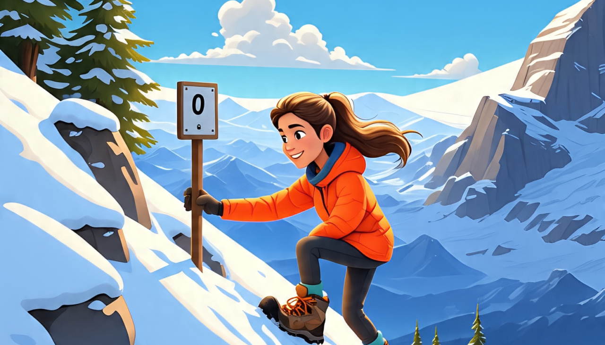

After months of relentless effort, self-doubt, and perseverance, I am finally stepping into a new chapter of my life — I’ve landed a developer role at Motiveminds, based in Bangalore. This achievement wasn’t handed to me on a silver platter; it’s the result of countless late nights, unwavering determination, and the support of amazing people who stood by me through every twist and turn of my journey and made it a little easier.

A dream I held onto during my initial years in SG was to take a six-month break — to leave behind the routine, save money, and travel the world. It was a way to find clarity, to reset my perspective, and to embrace the adventures life had to offer. Looking back, I realize that living through 2022 wasn’t as rosy as I had imagined it would be. There were days filled with uncertainty and battling the noise of external opinions that often made me doubt my own instincts.

But today, as I reflect on everything, I see how those experiences shaped me — made me more resilient, and more confident in my decisions. This isn't just about landing a job; it's about the journey and realizing that sometimes, you have to take the difficult road to reach your destination.
The path wasn’t simple, nor was it easy. But amidst those struggles, there were some truly remarkable individuals — friends, family, who believed in me even when I doubted myself.

When I first decided to move back, my mom’s initial question caught me off guard. She asked if I had discussed it with my then-fiancé, Sabz, and if he was okay with the decision. Honestly, I didn’t see why he needed to be involved in such a significant career move. It didn’t make sense to me; I hadn’t even asked him yet. Later, I wondered if that was going to be a red flag, but Sabz reassured me that it was my decision to make, and he would support me no matter what. That reassurance meant the world and gave me the confidence to follow through.

I encountered many skeptics along the way, a lot of questions from acquaintances and even strangers— "How will you manage life without a job?" they'd ask, as if I was living off their life's savings. Some questioned my decision to leave a well-paying job in a country that offers almost everything(SG). Others couldn’t understand why I was risking stability for an uncertain future in web development. A few even asked what I would do if I didn’t find a job or succeed. While some friends genuinely expressed concern and offered help with job searches, many others seemed to ask out of curiosity or, honestly, gossip. These voices, threatened to inject self-doubt into my mind and pull me down emotionally. It’s easy to let negativity seep in and make you question your choices.

Yet, amidst the negativity, I was fortunate to have a select few who truly understood where I was coming from — those who didn't always agree with my decisions but stood unwaveringly by my side, supporting me through every challenge. Their belief in me kept me going when I felt like giving up. To preserve my sanity and confidence, I consciously chose to spend time with those who accepted me for who I am — friends who didn’t press for updates on my plans or question my choices. Their support was a reminder that I didn’t need to justify my journey to everyone. Sometimes, all I needed was their presence and understanding, not a barrage of questions.

My life in Singapore was a blend of exploration and simple pleasures. My weekends were mostly spent trying new activities or taking short trips to nearby places across Southeast Asia. If I wasn’t traveling, I’d dedicate my weekends to a more personal passion — making Biriyani for BeeBee. Her love for Biriyani is beyond anything I’ve known — she would often travel hours just to spend the weekend with me, hoping to indulge in my version of Biriyani. She’s been my biggest cheerleader, inspiring me to hone my cooking skills and perfect that perfect biriyani.

During those six months of intense transition and self-reflection, I was caught in a whirlwind of conflicting emotions. I was trying to figure out what I truly wanted in life — leaving behind a stable job, pursuing web development, and planning a future that aligned with my passion. I was also emotionally drained, often unable to host or spend quality time with BeeBee, painfully saying no to her because I was so consumed with my own struggles. Her support, patience, and understanding meant everything, even when I couldn’t reciprocate as much as I wanted.

Prata was my lifeline during those three years. She'd text me relentlessly, checking in on my well-being, and always make time to see me and stay with me whenever she was in Chennai. Beyond the regular check-ins, she'd even scour the job boards for openings that might pique my interest. Talk about a dedicated friend! And, to top it all off, we were crazy enough to cram a whirlwind winter trip to Europe into our schedules, hopping from city to city.

Zort was there for me, encouraging me to study every day. We would spend time working through lessons, tackling personal projects, and even taking on freelancing gigs. But, of course, there were those dreaded "bleh" days when I just didn't feel motivated. On those days, Zort would lift my spirits by inviting me to play—our favorites being Raft and Overcooked. Those gaming sessions became a much-needed break and a reminder to find joy even during challenging times.

Among those who stood by me, VJ was a major catalyst. He was someone who understood the struggles of transitioning and taking unconventional paths. When I moved from Singapore, VJ also decided to pursue freelancing. He referred me to a frontend role in a startup that pushed me to learn React—a framework I had little experience with at the time. VJ’s encouragement played a significant role in my growth. I can't thank him enough. That referral into Rampnow and subsequent experience became a turning point, giving me the confidence to apply for developer roles. 

S2 and PP would visit me whenever they came to Chennai (mostly!). We’d explore new restaurants or simply hang out, have some Kalaan or catch a movie - sharing moments of respite amidst the chaos. 
Another important figure in my journey was Maggie. He would often take me out to hang out with his friends—wonderful people who welcomed me warmly. We’d sometimes be baking together or just sharing stories. 
Beyond these people, there are a few constants: Aloo, Spring, Vix, San, and Lucky. These people were my bedrock, my calibration for normalcy. They never questioned me, never treated me differently, and were simply… there. Their unwavering presence was a comforting anchor in a sometimes chaotic period.

This journey has taught me that growth often comes from the support of genuine relationships, self-acceptance, and the willingness to step into the unknown. I’ll be sharing more detailed stories in my upcoming posts. To everyone who believed in me, who offered a listening ear, or simply a word of encouragement— thank you. You are the reason I am here today, standing on the threshold of a new beginning. This victory is as much yours as it is mine. To those who questioned me — thank you for making me stronger. And to myself — I am proud of how far I’ve come. This is just the beginning, and I look forward to what the future holds.❤️‍🔥🌠
